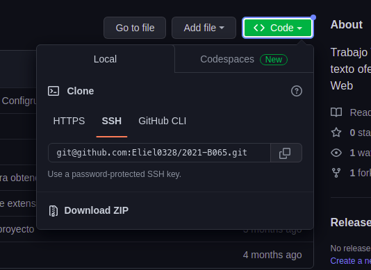
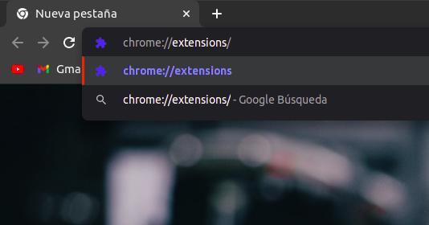
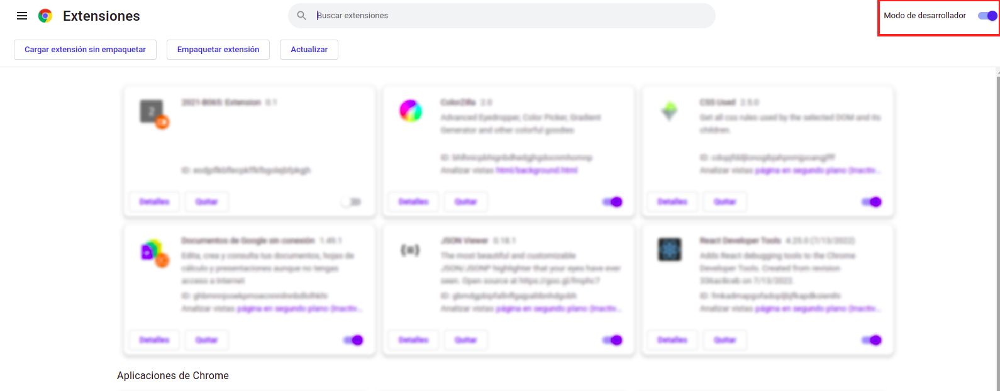
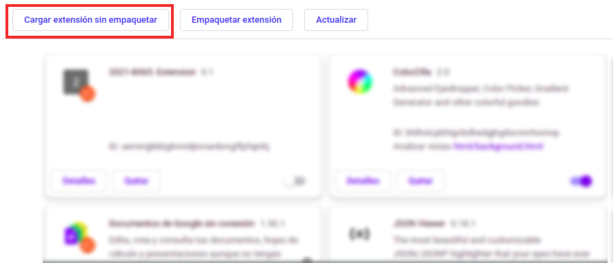
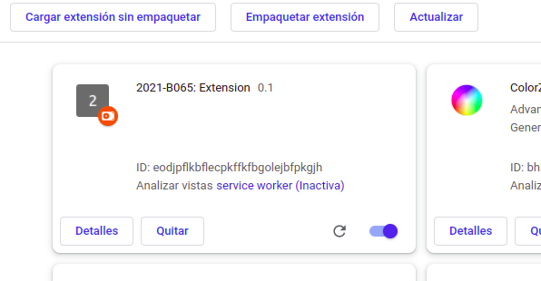
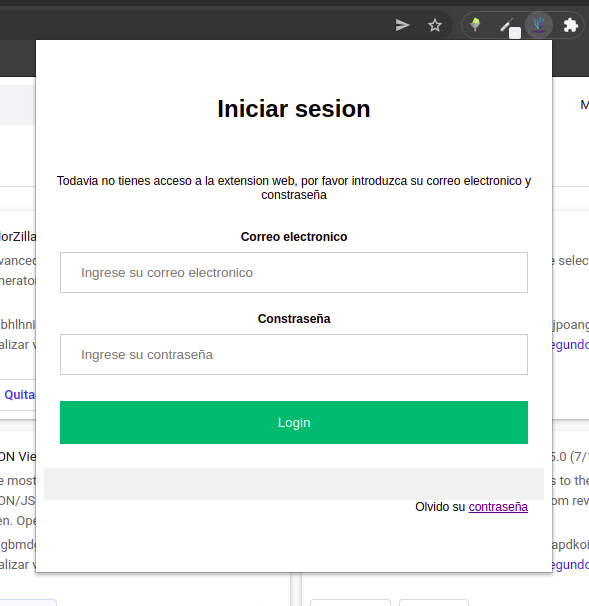
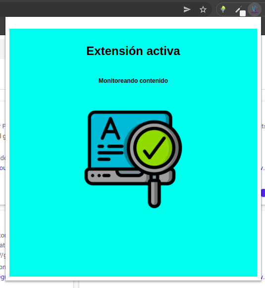
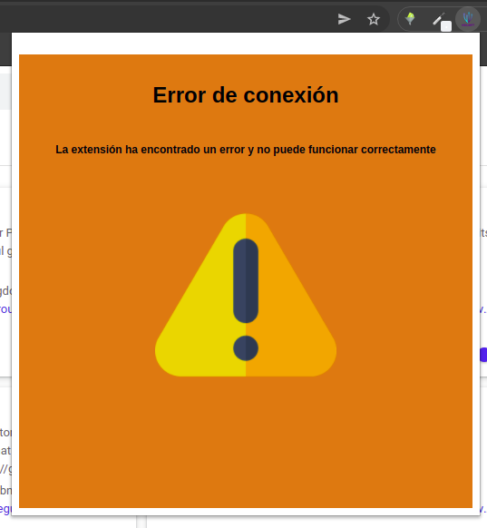

<!-- PROJECT LOGO -->
 

  

  <h3 align="center">
  Trabajo Terminal 2021-B065: Detector de texto ofensivo durante la navegación Web - Extension</h3>

  

  <a href="https://github.com/othneildrew/Best-README-Template"><strong>Revisar documento técnico »</strong></a>
   
   
  <a href="https://github.com/othneildrew/Best-README-Template/issues">Reportar Error</a>
    ·
    <a href="https://github.com/othneildrew/Best-README-Template/issues">Solicitar Función</a>
  

<!-- TABLE OF CONTENTS -->

  
Contenido

  <ol>
    <li>
      <a href="#acerca-del-proyecto">Acerca del Proyecto</a>
      <ul>
        <li><a href="#extensión-web">Extensión Web</a></li>
      </ul>
      <ul>
        <li><a href="#desarrollado-con">Desarrollado Con</a></li>
      </ul>
    </li>
    <li>
      <a href="#guía-de-instalación">Guía de Instalación</a>
      <ul>
        <li><a href="#prerequisitos">Prerequisitos</a></li>
        <li><a href="#instalación">Instalación</a></li>
      </ul>
    </li>
    <li><a href="#manual-de-uso">Manual de Uso</a></li>
  </ol>

<!-- ABOUT THE PROJECT -->

## Acerca del Proyecto

  

La creciente relación humana con los medios digitales nos ha llevado a una dependencia de esta tal que su uso no se ha limitado por edades dado que en la actualidad es necesario en algunos casos que los niños hagan uso de estas herramientas, dejándolos expuestos a un posible encuentro con lenguaje ofensivo en modo texto o en su defecto manejar lenguaje ofensivo

Para entender qué es el lenguaje ofensivo se debe revisar antes la definición de sus componentes, por lo tanto, según definiciones de la RAE el lenguaje es la facultad del ser humano de expresarse y comunicarse con los demás a través del sonido articulado o de otros sistemas de signos, es un sistema de comunicación que tiene como característica un estilo y modo de hablar y escribir de cada persona en particular. Mientras que la definición de un acto ofensivo sería todo aquel que tenga como objetivo humillar o herir el amor propio o la dignidad de alguien, puede considerarse también actos donde se dañen físicamente o maltraten a otra persona. Por lo tanto, en este trabajo el lenguaje ofensivo se definirá como “todas aquellas expresiones, palabras o texto que sean discriminatorias, despectivas y que tengan como propósito dañar a otra persona o grupo”.

Las extensiones web (también conocidos como add-ons) son aquellos aditamentos que se pueden agregar en los navegadores web (Google Chrome, Mozilla Firefox, entre otros) y que permiten realizar actividades en específico por lo que es posible interactuar con el contenido del HTML, de esta forma se puede saber el contenido de la página y hace posible el análisis para detectar el uso de lenguaje ofensivo. Para realizar este análisis se desarrollará un software que estará alojado en un servidor, el cual se comunicará con la extensión para obtener el contenido de las páginas visitadas durante la navegación mientras la extensión esté activa.

El sistema detecta el contenido de la navegación de los tutorados y notifica al tutor si se trata o hace uso de lenguaje ofensivo. Nuestro sistema se une a los diversos sistemas que tienen como objetivo detectar un acto ofensivo o discriminatorio los cuales se enfocan en detectar actos como el bullying, el acoso, el sexismo, racismo o algún otro acto ofensivo o denigrante. La diferencia sustancial es el método empleado para detectar su tema, en nuestro caso el lenguaje ofensivo es detectado por medio del análisis del texto de la página web, otra diferencia es el acto posterior al detectarlo pues lo que se realiza en nuestro sistema es enviar una notificación al tutor para que su criterio sea usado para juzgar el contenido visitado. De esta manera actos como el acosar o ser acosado en redes sociales, seguir discursos de odio, presenciar casos de racismo o participar en ellos, acceder a contenido para adultos, entre otras actividades podrían ser detectadas, prevenidas y discutidas por los involucrados (tutor y tutorado) para llegar a la mejor solución posible sin invadir la navegación o censurar el contenido directamente.

### Extensión web

La extensión web trabaja en forma conjunta al resto del sistema, por lo que es necesario instalarla su correcto funcionamiento. Las funciones realizadas son las siguientes:

- Inicio de sesión con una cuenta registrada en la plataforma.
- Compilar el texto del sitio web visitado.
- Envío de información al servidor web.

(<a href="#readme-top">volver al inicio</a>)

### Desarrollado con

En esta sección se listan los principales frameworks utilizados para el arranque y desarrollo de la extension.

-   
- 	
-   
-   
-   

(<a href="#readme-top">back to top</a>)

<!-- GETTING STARTED -->

## Guía de instalación

Este es un ejemplo de configuracion. Para poner en marcha la extensión en su navegador siga estos sencillos pasos de ejemplo:

### Prerequisitos

-   Navegador compatible con google Chrome
-   Cuenta de tutor [Vigilante](https://www.google.com.mx/)

### Instalación

_A continuación se muestran algunas opciones del proceso de instalación_

#### Opción 1

1. Descargar la extensión de este repositorio usando la opción de `Download ZIP` en la sección de Code de arriba.

  

2. Descomprimir el archivo descargado. Es recomendado usar 
[WinRAR](https://www.winrar.es/descargas/winrar) aunque cualquier programa para descomprimir archivos es válido.

3. Ingrese al navegador(compatible con Chrome) donde desea instalar la extensión web. En una nueva pestaña, sobre la barra de busqueda ingrese la siguiente dirección.

- `chrome://extensions/`

  

4. Una vez ingresando a la dirección se debe activar el modo desarrollador en la esquina superior derecha.

  

4. Se debe seleccionar la opción de cargar extensión sin empaquetar.

  

5. Se nos mostrara la opción de subir la extensión para lo cual debemos seleccionar la carpeta del archivo descomprimido. Al finalizar esta acción podra ver la extension con el resto de extensiones disponibles en el navegador.

  

(<a href="#readme-top">back to top</a>)

## Manual de Uso

A continuación se muestra como usar la extensión. Es importante recordar que es necesario tener una cuenta de tutor. Esta cuenta puede obtenerse en la plataforma [Vigilante](https://www.google.com.mx/).

_Revisar [Documento Técnico](https://www.google.com.mx/)_

Para hacer uso de la extensión es necesario iniciar sesión.

1. En parte superior derecha del navegador podra ver un botón que permite mostrar el listado de las extensiones. Se debe seleccionar la extensión y posteriormente iniciar sesión con los datos solicitados.

  

- Con la sesión iniciada el mensaje que vera será el siguiente (Lo que indica que la extensión esta activa).

  

- El siguiente mensaje se muestra en caso de que exista un error de conexión.

  

(<a href="#readme-top">back to top</a>)

